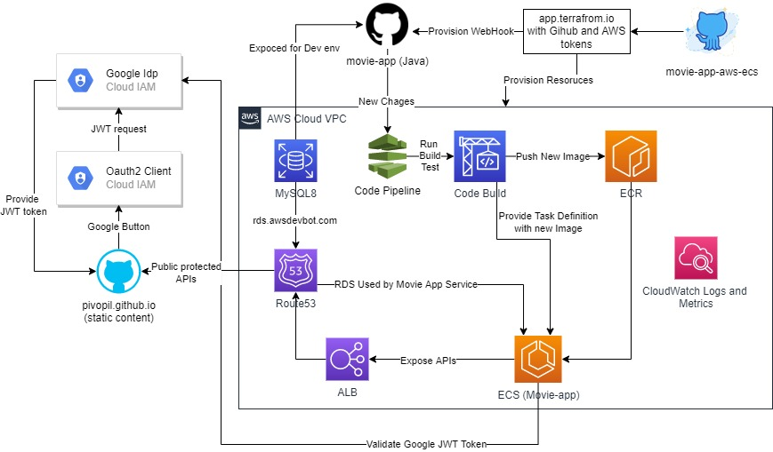
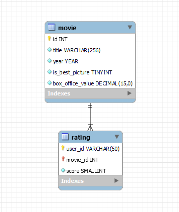

# movie-app
Movie Demo App

## Main components



### Quick Start
- [Go to the landing page](https://pivopil.github.io/)
- Use Google Login Button to get Google Id Jwt token
- Use any rest client to interact with APIs, like this

#### Get ten top-rated movies ordered by box office value
```shell
curl 'https://springbootapp.ecs.awsdevbot.com/api/movies/top' \
 --header 'Content-Type: application/json' \
 --header 'Authorization: GOOGLE_ID_TOKEN'
```

#### Set rating for the movie
```shell
curl --location --request PATCH 'https://springbootapp.ecs.awsdevbot.com/api/movies/16/rating' \
  --data-raw '{"score": 77 }' \
  --header 'Content-Type: application/json' \
  --header 'Authorization: GOOGLE_ID_TOKEN'
```

#### Get Movie by title with Best Picture Oscar (be sure to replace spaces with the plus symbol)
```shell
curl 'https://springbootapp.ecs.awsdevbot.com/api/movies/search/findAllByTitle?title=Avatar' \
  --header 'Content-Type: application/json' \
  --header 'Authorization: GOOGLE_ID_TOKEN'
```

### Java App Overview
- [Github repo](https://github.com/Pivopil/movie-app)
- [Generate template using Spring Initializr](https://start.spring.io/)
- Java 11
- Spring (Boot, Security, MVC, JPA, REST, Actuator, Validation, ...)
- Maven
- MySQL 8
- H2
- Liquibase
- Docker
- Google Identity Java SDK for the integrations with Google IAM
- Github Web Hooks for the integration with AWS Code Pipeline

### MySQL8 Database schema



#### Movie table

Movie table contains [prepared](https://github.com/Pivopil/movie-app/tree/main/data_loader)
- **year** - got this data from CSV file
- **title** - got this data from CSV file
- **is_best_picture** - got this data from CSV file
- **box_office_value** - the box office, got this value from [www.omdbapi.com](https://www.omdbapi.com) at the data preparation step using 'year' and 'title' from csv

#### Rating table

- **user_id** - 'sub' claim from Google Id token 
- **movie_id** - foreign key for Movie id
- **score** - value from 0 to 99, given by user
- primary key includes both user_id and movie_id, so user could create or update only one, personal score

### Frond End App Overview
- [Static content with index page are hosted on Github](https://pivopil.github.io/)
- [Repository with code](https://github.com/Pivopil/pivopil.github.io)
- HTML5
- CSS3
- Bulma
- Google Identity JS SDK

### CI CD pipeline and infrastructure Overview
- [Repo with movie-app terraform](https://github.com/Pivopil/movie-app-aws-ecs)
- AWS Cloud
- Route53
- ACM
- AWS MySQL RDS
- Code Build
- Code Deploy
- ECS Fargate
- ALB
- CloudWatch
- S3
- ECR

### Movie Data Preparation App
- [Simple CSV to SQL converter with HTTP client](https://github.com/Pivopil/movie-app/tree/main/data_loader)
- Nodejs
- www.omdbapi.com public API (used to get box office value)